# Tutorial - Keycloak

- [Tutorial - Keycloak](#tutorial---keycloak)
      - [Table of Contents](#table-of-contents)
  - [Installation](#installation)
    - [local](#local)
      - [database](#database-installation) - via docker
      - [keycloak](#keycloak-installation) - via docker
      - [minikube](#minikube) - via kubernetes

## Installation

This tutorial is versioned for:

* keycloak 25.0.4
* mysql 8.4.2

Keycloak uses a relational database to persist the information.  We'll need to start up a database.  Many are supported and this tutorial will use MySQL as the datastorage.

## local

### database installation

Create a network for keycloak and our database.  This allows them to find each other by the name that we specify for the container.

```
docker network create knetwork
```
This is an example of docker w/o any containers running locally.


Start up mysql 8.4.2
```
docker run \
    -p 3306:3306 \
    --name local_mysql \
    -e MYSQL_ROOT_PASSWORD=mysql \
    -v ./.local_mysql:/var/lib/mysql \
    -d \
    --net knetwork \
    mysql:8.4.2 \
    --mysql-native-password=ON
```

Once you have it up mysql up and running here is what docker will look like.


Now to test logging in remotely.  You need to specify the  
```
mysql -h 127.0.0.1 -u root -pmysql mysql
```

As an alternative you can put the following in your ~/.my.cnf and then you do not needed to specify the host as 127.0.0.1
```
[client]
protocol=tcp
```

Now this works
```
mysql -u root -pmysql mysql
```

### keycloak installation

First we need to configure mysql with a keycloak database.  Run the following command to create our username/password and database

```
./database/keycloakDatabaseSetup.sh install
```

To start up keycloak we'll use a mysql tuned version.  We will name the image 'local_keycloak' and give it a version of 0.0.1  We can reference that in the docker run command below

```
docker build . -t local_keycloak:0.0.1
```

Start up keycloak in development mode - recommend for our tutorial.
```
docker run --name local_keycloak --net knetwork -p 8080:8080 -e KEYCLOAK_ADMIN=admin -e KEYCLOAK_ADMIN_PASSWORD=admin -d local_keycloak:0.0.1 start-dev
```

Start up keycloak in production mode
```
docker run --name local_keycloak --net knetwork -p 8443:8443 -p 9000:9000 -e KEYCLOAK_ADMIN=admin -e KEYCLOAK_ADMIN_PASSWORD=admin -d local_keycloak:0.0.1 start --optimized
```

Docker will now look like this:


## Configuration

Run the following commands to setup keycloak

```
./keycloak/bin/createRealm.sh

./keycloak/bin/createClient.sh backend
./keycloak/bin/createClient.sh frontend

./keycloak/bin/createRole.sh admin
./keycloak/bin/createRole.sh user

./keycloak/bin/createUser.sh user1
./keycloak/bin/createUser.sh user2

```

To login to keycloak you can now head to http://localhost:8080 and use the credentials we specified in the environment variables above of admin/admin.

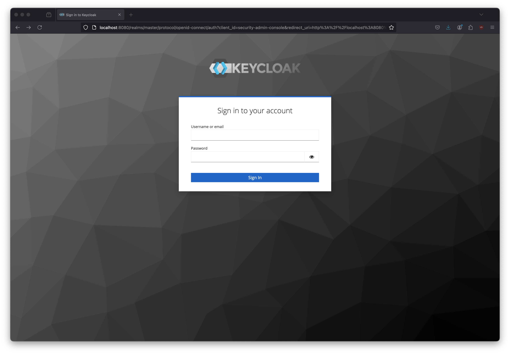

When you log in this is the screen you'll see.

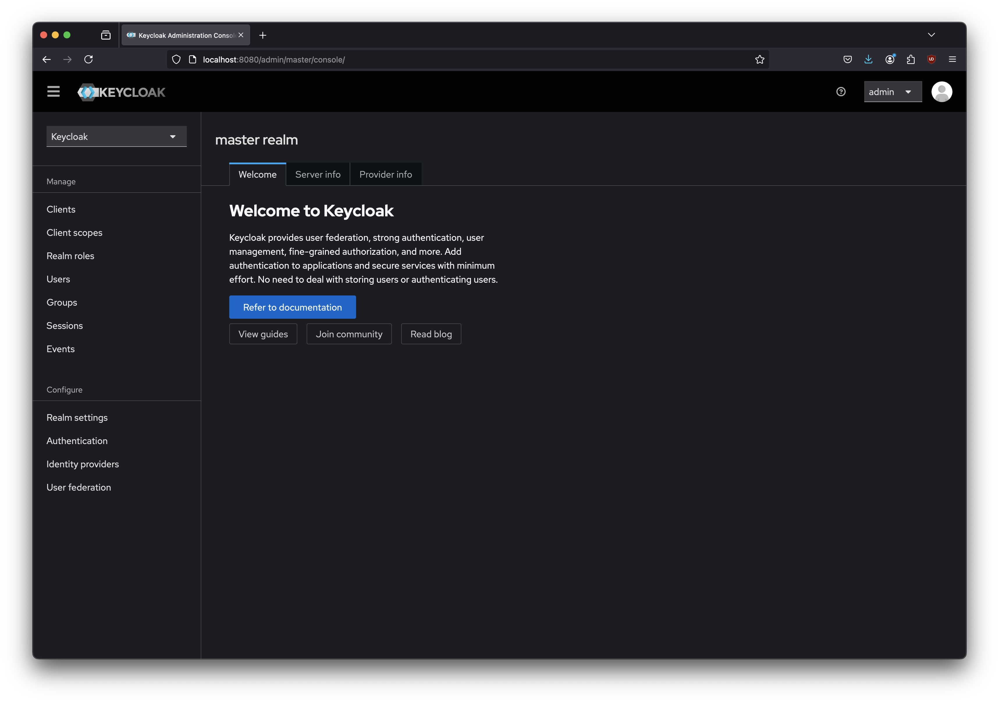

The realm is setup to have the usernames be emails and they use that to login.

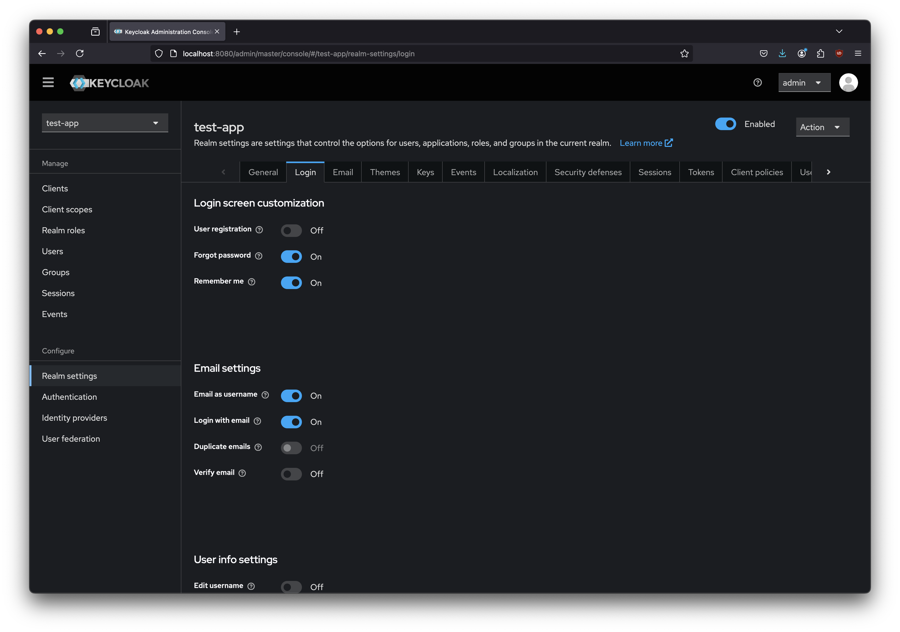

Now, in the upper left where it says 'Keycloak' select the drop down and click on the 'test-app'.

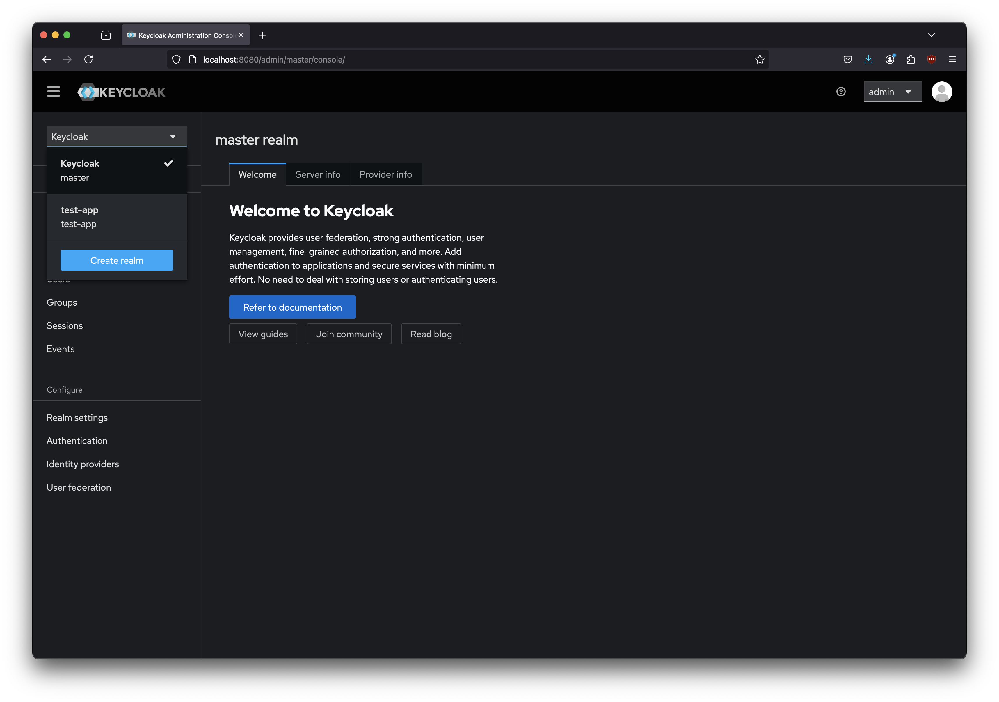

Select the 'Clients' on the left to see the two clients we created 'backend' and 'frontend'.  We've specified something in the description to keep us organized.

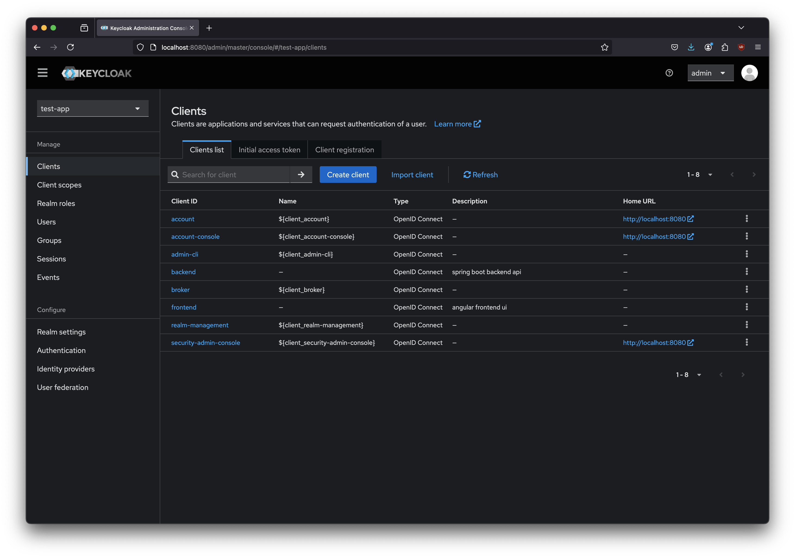

The backend client.


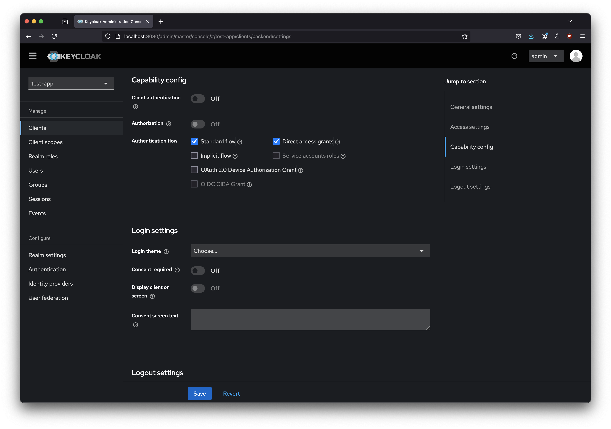

The frontend client.

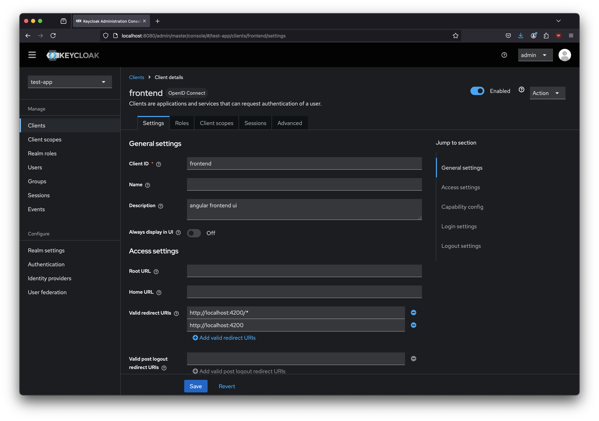
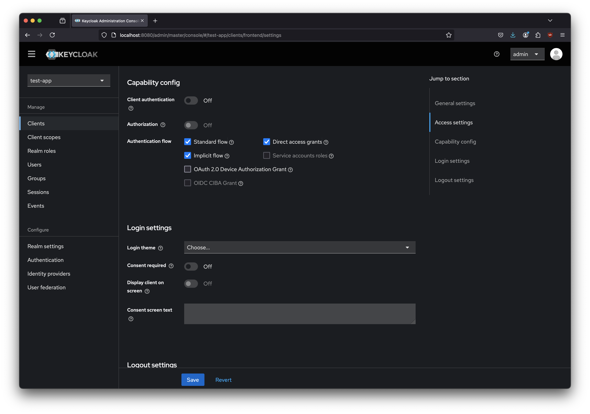

The two roles we created are realm-level roles.  You can also create client level roles, but we are not doing that level of granularity.

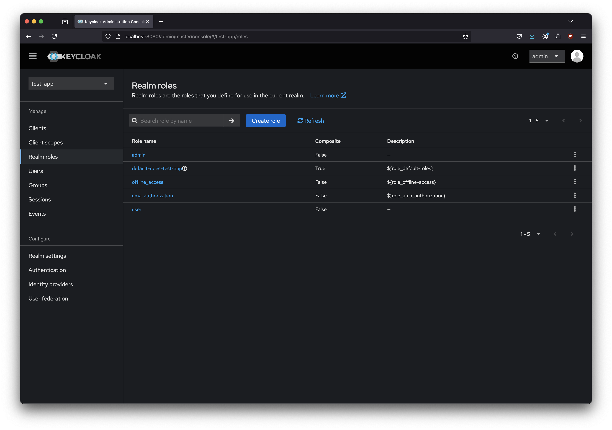

The users screen.

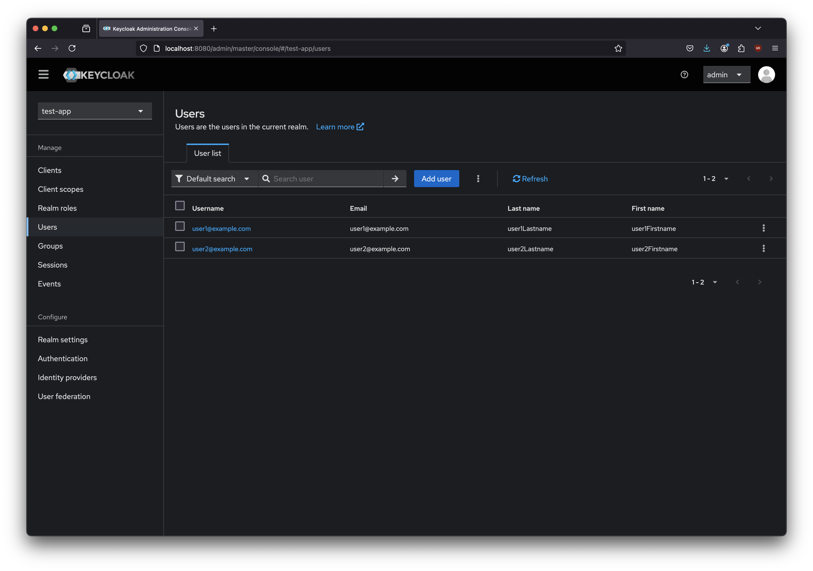

User1 is created just as a regular user.
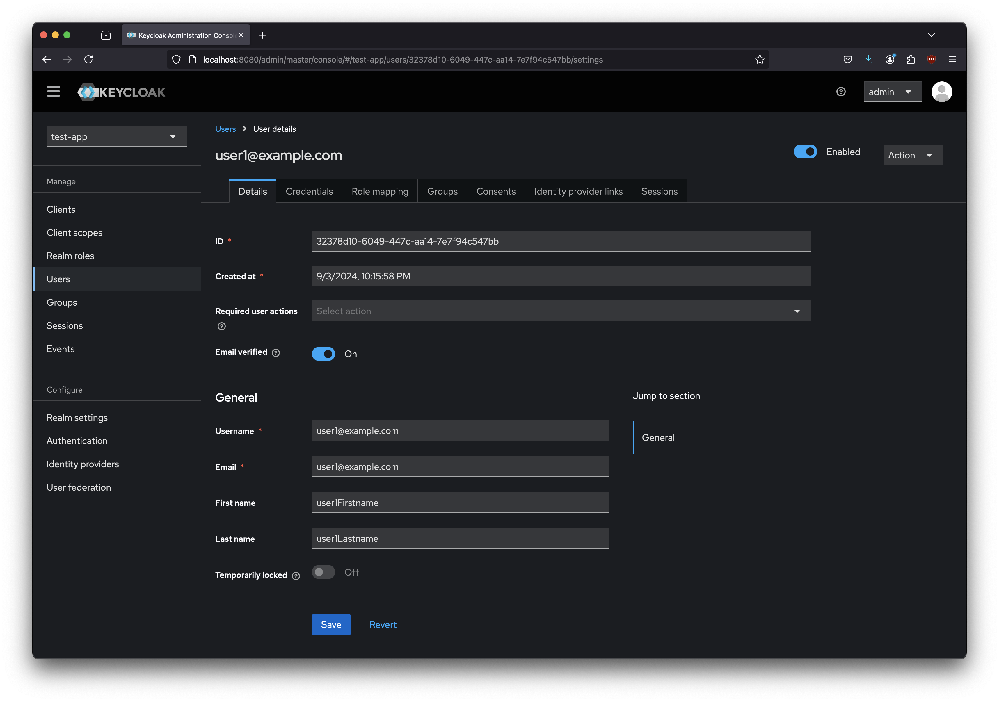
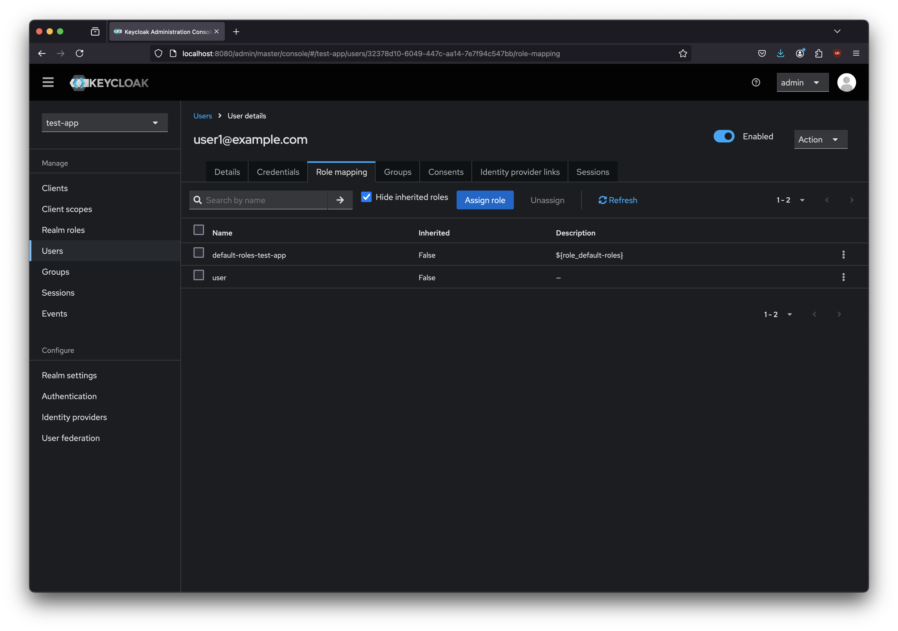

User 2 is created as an admin user.


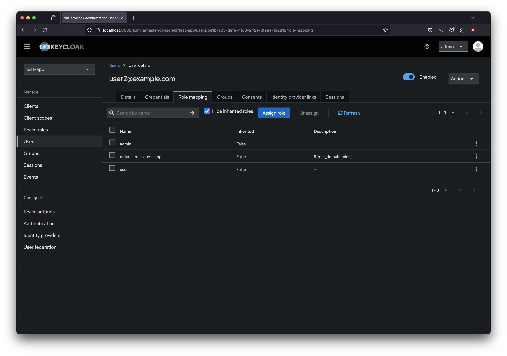
