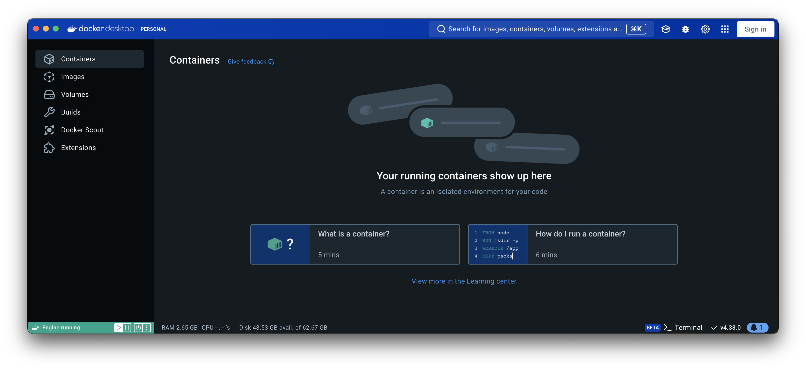

# Tutorial - Keycloak

- [Tutorial - Keycloak](#tutorial---keycloak)
      - [Table of Contents](#table-of-contents)
  - [Installation](#installation)
    - [local](#local)
      - [database](#database-installation) - via docker
      - [keycloak](#keycloak-installation) - via docker
      - [minikube](#minikube) - via kubernetes

## Installation

Keycloak uses a relational database to persist the information.  We'll need to start up a database.  Many are supported and this tutorial just simply uses MySQL as the datastorage.

## local

### database installation

Create a network for our keycloak and our database.  This allows them to find each other by the name that we specify for the container.

```
docker network create knetwork
```

Start up mysql 8.4.2
```
docker run \
    -p 3306:3306 \
    --name local_mysql \
    -e MYSQL_ROOT_PASSWORD=mysql \
    -v ./local_mysql:/var/lib/mysql \
    -d \
    --net knetwork \
    mysql:8.4.2 \
    --mysql-native-password=ON
```

This is an example of docker w/o any containers running locally.


Once you have it up mysql up and running here is what docker will look like.


Now to test logging in remotely.  You need to specify the  
```
mysql -h 127.0.0.1 -u root -pmysql mysql
```

As an alternative you can put the following in your ~/.my.cnf and then you do not needed to specify the host as 127.0.0.1
```
[client]
protocol=tcp
```

Now this works
```
mysql -u root -pmysql mysql
```

### keycloak installation

To start up keycloak we'll use a mysql tuned version.  We will name the image 'local_keycloak' and give it a version of 0.0.1  We can reference that in the docker run command below

```
docker build . -t local_keycloak:0.0.1
```

Start up keycloak in development mode - recommend for our tutorial.
```
docker run --name local_keycloak --net knetwork -p 8080:8080 -e KEYCLOAK_ADMIN=admin -e KEYCLOAK_ADMIN_PASSWORD=admin -d local_keycloak:0.0.1 start-dev
```

Start up keycloak in production mode
```
docker run --name local_keycloak --net knetwork -p 8443:8443 -p 9000:9000 -e KEYCLOAK_ADMIN=admin -e KEYCLOAK_ADMIN_PASSWORD=admin -d local_keycloak:0.0.1 start --optimized
```

Docker will now look like this:

